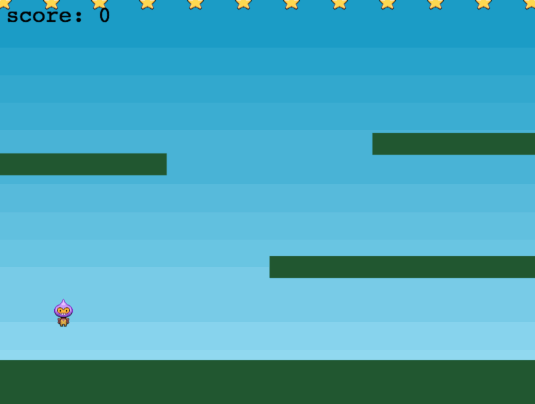
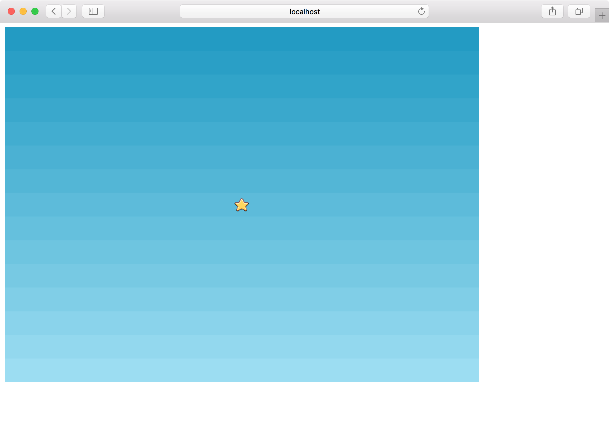
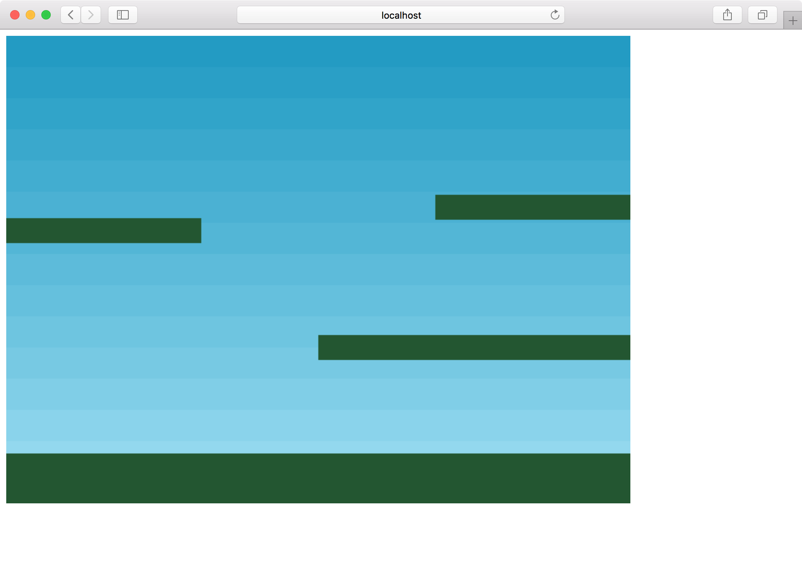

今日は公式サイトの[Making your first Phaser 3 game](http://phaser.io/tutorials/making-your-first-phaser-3-game)に沿って初めてのゲームを作ってみます。

作るのはこのような星取りゲームです。

基本的に本家の通り進めていきますが、記法はモダンなJSで書きたいため、[前回](../2018-12-03/)作った<https://github.com/tnantoka/hello-phaser-webpack>をベースにします。



## プロジェクト作成

```
$ git clone git@github.com:tnantoka/hello-phaser-webpack.git phaser-first-game
$ cd phaser-first-game
$ yarn install
$ yarn start
$ open http://localhost:8080/
```

これでHello World!が動く状態になります。

## assetsの準備

<http://phaser.io/tutorials/making-your-first-phaser-3-game/phaser3-tutorial-src.zip>をダウンロードして、中身のassetsを`dist/assets`に配置します。

## index.jsの準備

`src/index.js`を以下の内容に書き換えます。
ES2015の記法によりsceneの中身が元のチュートリアルより少しスッキリしています。

```
const config = {
  type: Phaser.AUTO,
  width: 800,
  height: 600,
  scene: {
    preload,
    create,
    update
  }
};

const game = new Phaser.Game(config);

function preload() {
}

function create() {
}

function update() {
}
```

`type`は`AUTO`にしておくとデフォルトでWebGLが、未対応のブラウザーではCanvasが使われます。
`Phaser.CANVAS, Phaser.WEBGL`として自分で指定することもできます。

`width`と`hight`はそのまま幅と高さです。

他の設定項目は<https://photonstorm.github.io/phaser3-docs/global.html#GameConfig>に載っています。

この状態で実行すると800 x 600の真っ黒の画面が表示されます。

## 画像を読み込む

`preload`を実装して、4つの画像と1つのスプライトシートを読み込みます。
`preload`はゲームのシーン作成の前に処理される関数です。

```
function preload() {
  this.load.image('sky', 'assets/sky.png');
  this.load.image('ground', 'assets/platform.png');
  this.load.image('star', 'assets/star.png');
  this.load.image('bomb', 'assets/bomb.png');
  this.load.spritesheet('dude', 'assets/dude.png', {
    frameWidth: 32,
    frameHeight: 48
  });
}
```

スプライトシートは、以下のようにスプライトが並んだ画像を用意し、分割されるフレームのサイズを指定します。


## 画像の表示

`create`はゲームのシーン作成時に呼び出される処理です。
今回はここで2つの画像を表示します。

```
function create() {
  this.add.image(400, 300, 'sky');
  this.add.image(400, 300, 'star');
}
```

`sky`はゲームのサイズと同じく800 x 600です。Phaserのオブジェクトは中心を基準に配置されるため、400 x 300を指定することで空が全面に配置されます。
また、デフォルトでは後に追加した画像の方が上になるため、星が空より手前に表示されます。



## 物理演算

次にステージの床を表示します。

これ以降、物理演算の機能を使うため、`config`に`physics`の設定を追加します。

```
  physics: {
    default: 'arcade',
    arcade: {
      gravity: { y: 300 },
      debug: false
    }
  },
```

defaultには物理演算のモードを指定します。`Impact.js`や`Matter.js`モードも用意されているようですが、シンプルな用途では`arcade`で十分そうです。
`gravity`は重力です。`debug`を`true`にするとBodyが枠で囲まれて目に見えるようになります（物理エンジンでおなじみの機能）

これで準備はOKなので`create`で床を表示します。
先程追加した星は消します。

```
  const platforms = this.physics.add.staticGroup();

  platforms.create(400, 568, 'ground').setScale(2).refreshBody();

  platforms.create(600, 400, 'ground');
  platforms.create(50, 250, 'ground');
  platforms.create(750, 220, 'ground');
```

staticGroupに登録されたオブジェクトは自動で静的になるので、動かなくなります。
一番下の床は大きくしたいのでsetScale(2)をしています。静的なオブジェクトは手動で更新する必要があるので`refreshBody`を呼びます。

このあたりは<https://photonstorm.github.io/phaser3-docs/Phaser.Physics.Arcade.Sprite.html>に記載があります。

これでステージの床が表示されました。



今回はここまでです。

[本家チュートリアルの4回目](http://phaser.io/tutorials/making-your-first-phaser-3-game/part4)までが終わりました。
