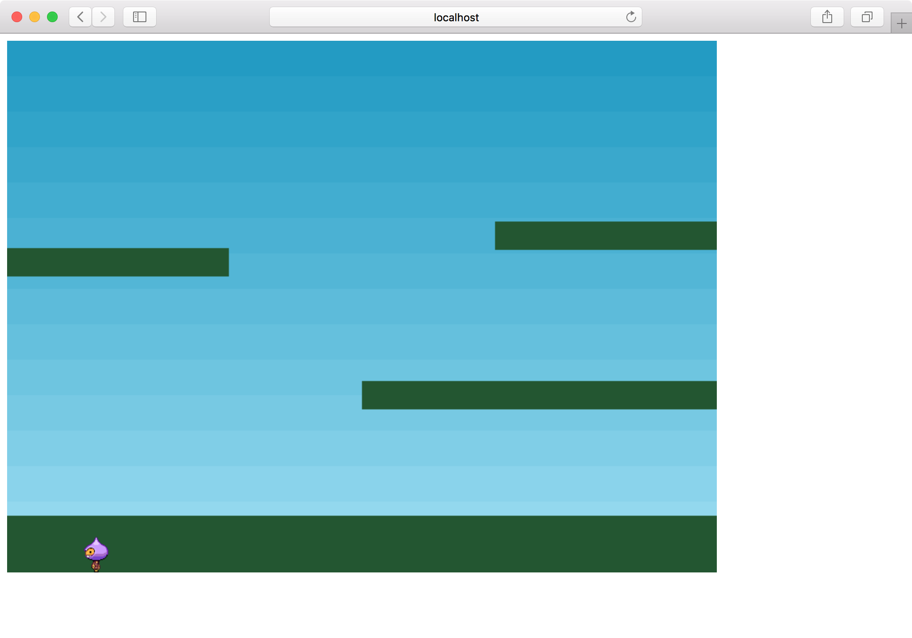

[前回](../2018-12-04)の続きで、[Making your first Phaser 3 gameの5回目](http://phaser.io/tutorials/making-your-first-phaser-3-game/part5)から進めていきます。

## プレイヤーの表示

プレイヤーを追加します。

```
  const player = this.physics.add.sprite(100, 450, 'dude');

  player.setBounce(0.2);
  player.setCollideWorldBounds(true);
```

`setBounce`は弾む強さを設定します。`setCollideWorldBounds`することで画面の端でバウンスします。

## アニメーションの登録

プレイヤーのアニメーションを登録します。

```
  this.anims.create({
    key: 'left',
    frames: this.anims.generateFrameNumbers('dude', { start: 0, end: 3 }),
    frameRate: 10,
    repeat: -1
  });

  this.anims.create({
    key: 'turn',
    frames: [ { key: 'dude', frame: 4 } ],
    frameRate: 20
  });

  this.anims.create({
    key: 'right',
    frames: this.anims.generateFrameNumbers('dude', { start: 5, end: 8 }),
    frameRate: 10,
    repeat: -1
  });
```

`frames`に指定した位置の画像をスプライトシートから読み出してアニメーションします。
`left`は0〜3番、`right`は5〜8番、`turn`は4番を使います。


`repeat: -1`はループする設定です。

実行すると下の地面に着いたところで弾んでとまります。



ちなみに、前回出てきた`physics`の`debug`を`true`にすると、Playerの周りに枠が表示されます。


以下を追加することで地面とプレイヤーが衝突するようになります。

```
this.physics.add.collider(player, platforms);
```


## キー入力

関数の外で`player`と`cursors`変数を宣言します。

```
let player;
let cursors;
```

`create`の中で`player`と`cursors`を代入します。

```
  player = this.physics.add.sprite(100, 450, 'dude');

  cursors = this.input.keyboard.createCursorKeys();
```

`player`はもともとあったものから`const`を取り除いただけです。
`cursors`はカーソルキーを使う時のおまじないです。


あとは`update`の中で`cursors`を使って処理します。

```
  function update() {
    if (cursors.left.isDown) {
      player.setVelocityX(-160);
      player.anims.play('left', true);
    } else if (cursors.right.isDown) {
      player.setVelocityX(160);
      player.anims.play('right', true);
    } else {
      player.setVelocityX(0);
      player.anims.play('turn');
    }
    if (cursors.up.isDown && player.body.touching.down) {
      player.setVelocityY(-330);
    }
  }
```

左キーが押されていれば、`setVelocityX`で移動させ、`left`のアニメーションを再生します。
右キーはその反対の処理です。

どちらも押されていなければ、移動を止めアニメーションを`turn`にします。

上キーが押されていればジャンプします。
`touching.down`は床に触れたかの判定です。これがないと何回もジャンプできて水中のマリオみたいになってしまう
 
空中で方向転換できたり、矢印を離すと急にこっちみたり挙動不審なところはありますが、これで一応操作可能になりました。


[7回目](http://phaser.io/tutorials/making-your-first-phaser-3-game/part7)まで終わりました。
