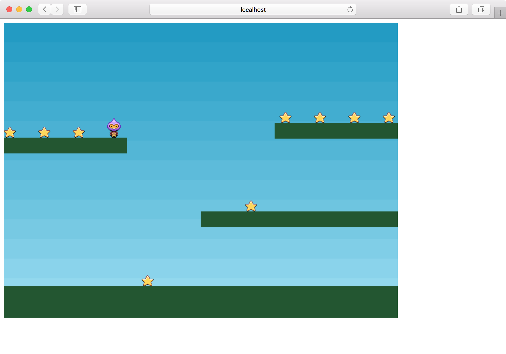
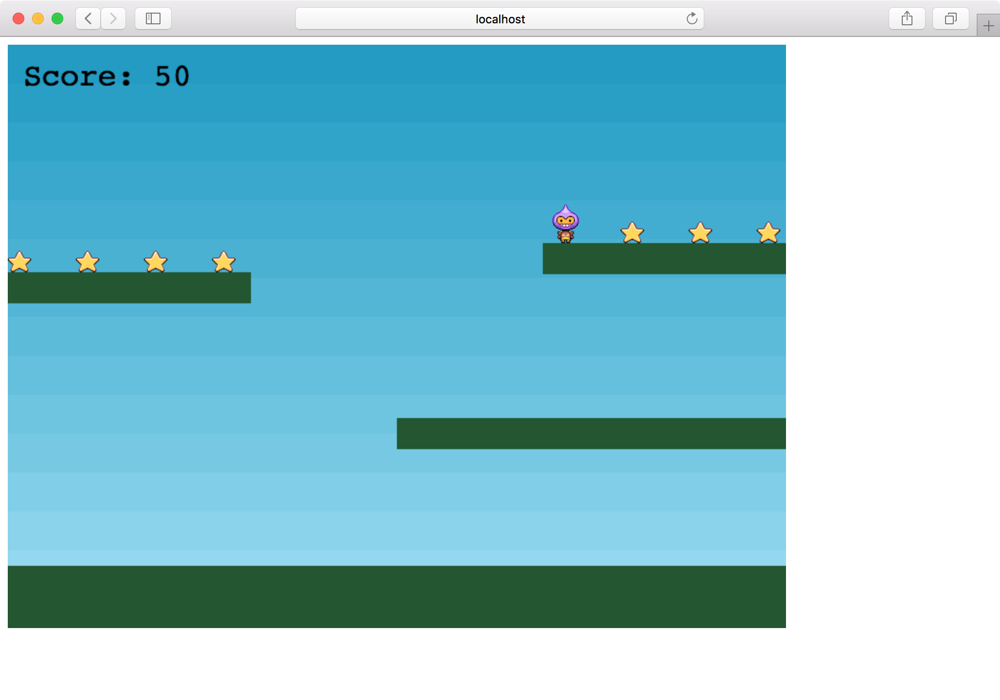
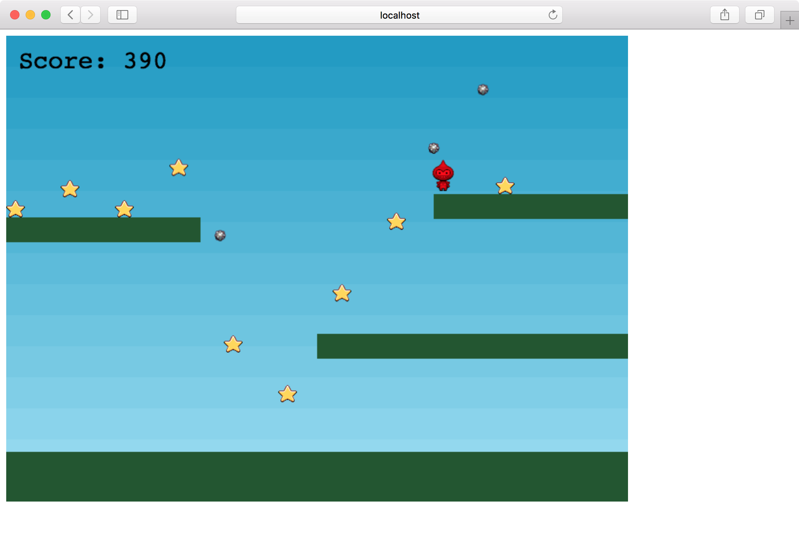

[前回](../2018-12-05)まででプレイヤーが操作できるようになりました。
今回は[Making your first Phaser 3 gameの8回目](http://phaser.io/tutorials/making-your-first-phaser-3-game/part8)から最後までやってしまいます。

## 星

`create`で星を追加します。

```
  const stars = this.physics.add.group({
    key: 'star',
    repeat: 11,
    setXY: { x: 12, y: 0, stepX: 70 }
  });

  stars.children.iterate(function (child) {
    child.setBounceY(Phaser.Math.FloatBetween(0.4, 0.8));
  });

  this.physics.add.collider(stars, platforms);
```

`setXY`でx座標を70ずつ進めて11個置きます。
また、`setBounceY`で弾みをランダムに変えます。
`collider`はプレイヤーと同じく床と衝突するようにしています。

さらに、`overlap`によりプレイヤーと星が重なった時の処理を指定します。
1つ目と2つ目の引数で対象を指定します。
3つ目は`collideCallback(object1, object2)`で実際に処理をする関数です。
4つ目の引数は`processCallback(object1, object2)`で`true`を返したときだけ第3引数の`collideCallback`が呼ばれます。今回はnullにしているので常に`collideCallback`が呼ばれます。
5つ目は`callbackContext`で`callback`を実行するコンテキストです。

```
  this.physics.add.overlap(player, stars, collectStar, null, this);
```

`collectStar`では、プレイヤーと重なった星のボディーを無効化して、オブジェクトを非表示にしています。

```
function collectStar(player, star) {
  star.disableBody(true, true);
}
```

これで星を取れるようになりました。



## スコア

星を取った時にスコアが加算されるようにします。

スコアの計算用の変数と、スコアを表示するテキストのオブジェクトを入れる変数を用意します。

```
let score = 0;
let scoreText;
```

`create`の中でテキストオブジェクトを追加します。
フォントはデフォルトで`Courier`が使われます。

```
  scoreText = this.add.text(16, 16, 'score: 0', { fontSize: '32px', fill: '#000' });
```

`collectStar`でスコアを更新します。

```
  score += 10;
  scoreText.setText('Score: ' + score);
```

得点が表示されるようになりました。



## ボム

最後の仕上げです。
星を全部取ったら星を再表示すると同時に動き回るボムを追加します。
ボムに当たるとゲームオーバーです。

ボムを入れる変数と、星を入れる変数を用意します。

```
let bombs;
let stars;
```

`create`で定義している`stars`の`const`を取り除きます。

```
  stars = this.physics.add.group({
    key: 'star',
    repeat: 11,
    setXY: { x: 12, y: 0, stepX: 70 }
  });
```

ボムを追加します。
ボムは地面とプレイヤーと衝突します。
プレイヤーと衝突した時の処理は`hitBomb`で行ないます。

```
  bombs = this.physics.add.group();
  this.physics.add.collider(bombs, platforms);
  this.physics.add.collider(player, bombs, hitBomb, null, this);
```

`hitBomb`では物理演算を止め、プレイヤーを赤色にしてアニメーションを`turn`にします。

```
function hitBomb(player, bomb) {
  this.physics.pause();

  player.setTint(0xff0000);
  player.anims.play('turn');
}
```

最後に`collectStar`でボムを表示させます。
アクティブな星が1つもなくなった場合、星のボディーを全部有効化し、位置や速度が毎回違うボムを追加します。

```
  if (stars.countActive(true) === 0) {
    stars.children.iterate(function (child) {
      child.enableBody(true, child.x, 0, true, true);
    });

    var x = (player.x < 400) ? Phaser.Math.Between(400, 800) : Phaser.Math.Between(0, 400);

    var bomb = bombs.create(x, 16, 'bomb');
    bomb.setBounce(1);
    bomb.setCollideWorldBounds(true);
    bomb.setVelocity(Phaser.Math.Between(-200, 200), 20);
    bomb.allowGravity = false;
  }
}
```

これでゲームオーバーにならない限り続けて遊べるようになりました。



最初のゲーム作成は以上です。

画像やルールを変更して自分なりのゲームにしてみるのもよいでしょう。

完成したソースコードは<https://github.com/tnantoka/phaser-first-game>で公開しています。
