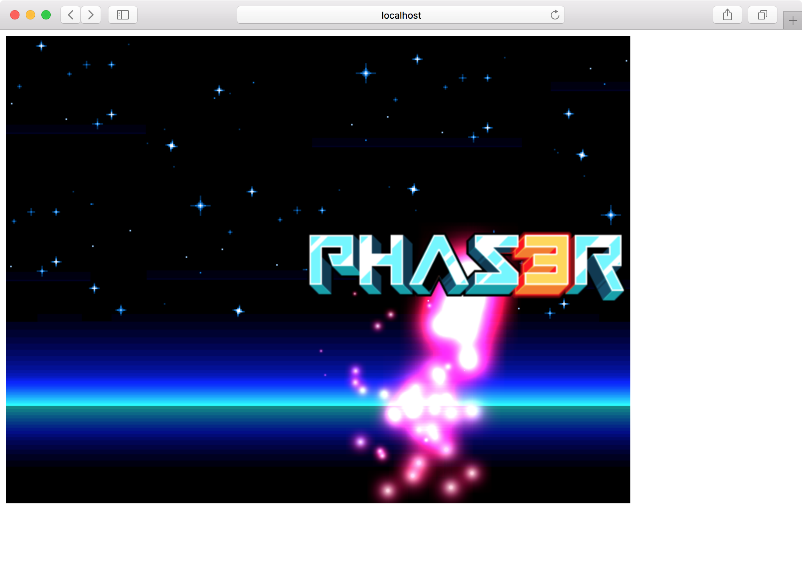
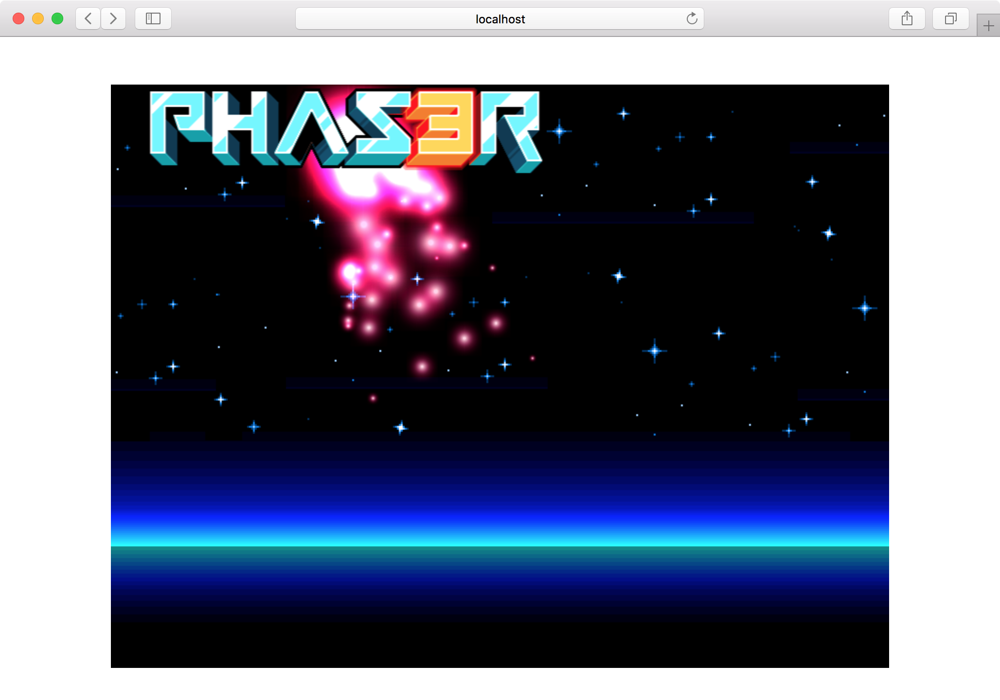
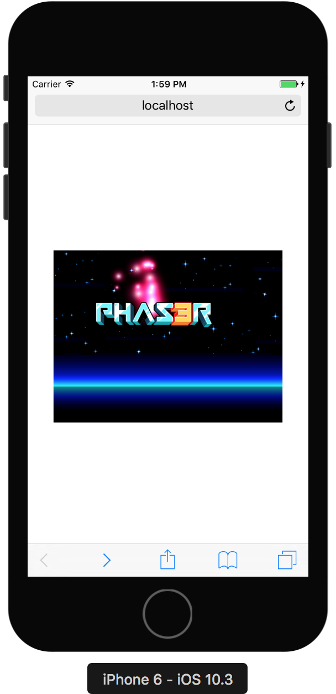
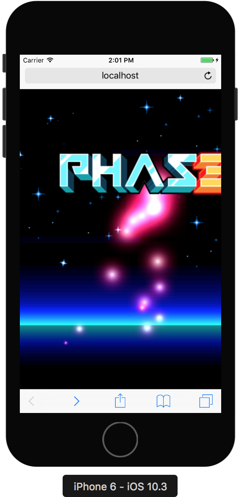
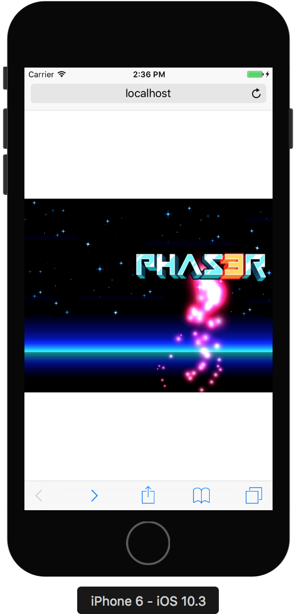
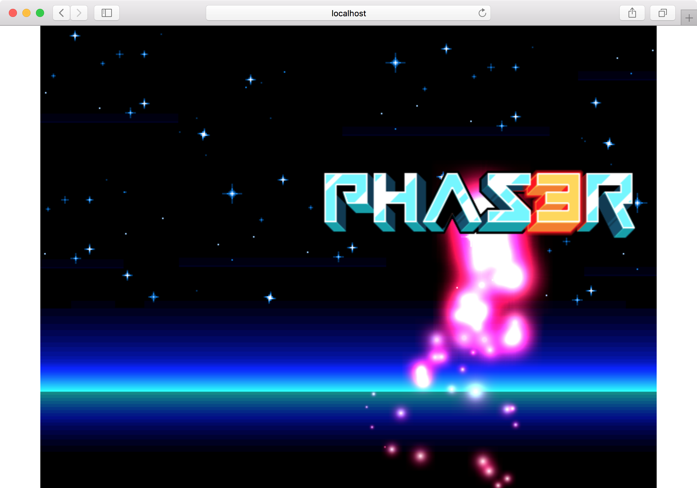

これまでのゲームは固定サイズで画面左上に表示していました。



サンプルならそれでも問題ありませんが、誰かに遊んでもらうために公開するようなゲームは、中央に表示したり、デバイスサイズに合わせたりしたいところです。

## 中央表示

まずは中央表示です。

PCしかサポートしないのであれば、適度なサイズを指定しておいて中央表示すれば十分でしょう。
HTML、CSSを少し変更するだけで実現できます。

`pahser-centering`という名前でプロジェクトを作ります。

```
$ git clone git@github.com:tnantoka/hello-phaser-webpack.git phaser-centering
$ cd phaser-centering
$ yarn install
```

`dist/index.html`を修正して、`style.css`を読み込みます。

```
    <link rel="stylesheet" href="style.css">
```

`dist/style.css`で中央表示になるようにスタイルを書きます。
書き方はいろいろありますが、ここでは`flex`を使います。

```
html, body {
  height: 100%;
}

body {
  display: flex;
  align-items: center;
  justify-content: center;
  margin: 0;
}
```

これで中央に表示されるようになりました。



## 自動リサイズ

ゲームフレームワークにはデバイスサイズに応じてゲームのサイズを変更できる機能があります。

たとえばiOSのSpriteKitであれば、[scaleMode](https://developer.apple.com/documentation/spritekit/skscene/1519562-scalemode)を指定するだけでOKです。

Phaserには今の所そのような機能はないようです。

といっても`canvas`要素のサイズを変えれば自動でゲームのリサイズもされるようなので、`window`の`resize`イベントで処理すればOKです。

まずは`dist/index.html`でviewportの指定をして、拡大縮小も禁止します。

```
    <meta name="viewport" content="width=device-width, user-scalable=no">
```

### viewport指定前



### viewport指定後




そして`dist/index.js`でリサイズの処理を書きます。

```
function onResize() {
  const { innerWidth, innerHeight } = window;

  const canvas = document.querySelector('canvas');
  const canvasWidth = parseInt(canvas.style.width);
  const canvasHeight = parseInt(canvas.style.height);

  const widthRatio = innerWidth / canvasWidth;
  const heightRatio = innerHeight / canvasHeight;
  const minRatio = Math.min(widthRatio, heightRatio);
  canvas.style.width = canvasWidth * minRatio + 'px';
  canvas.style.height = canvasHeight * minRatio + 'px';
}

window.addEventListener('load', () => {
  onResize()
});

window.addEventListener('resize', onResize);
```

canvasとwindowsの幅・高さの比率を計算し、小さい方に合わせてcanvasの幅・高さを変更しています。
これでモバイル・PCともにアスペクト比を保ったままで幅・高さのどちらかが画面いっぱいまで使われるようになりました。

### モバイル



### PC



今回のソースコードはこちらです。

<https://github.com/tnantoka/phaser-centering>
