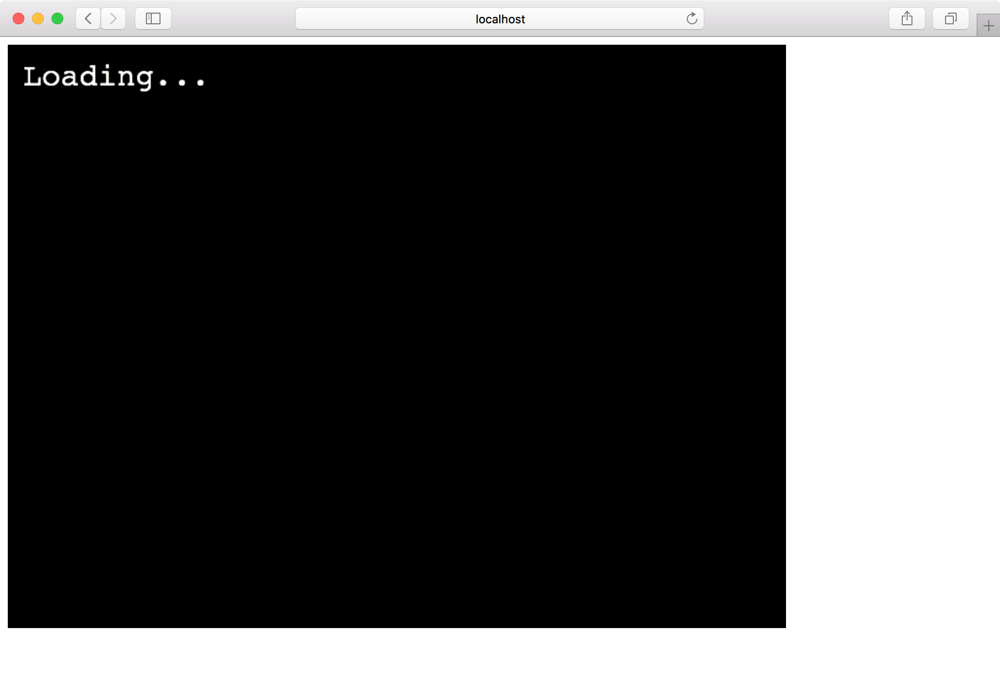

これまで作ったゲームは1つのシーンしかありませんでしたが、通常ゲームはタイトル・プレイ・結果など複数のシーンで構成されます。

今回はPhaserに2つのシーンを登録し、遷移させてみます。

いつも通りプロジェクトを作成します。

```
$ git clone git@github.com:tnantoka/hello-phaser-webpack.git phaser-scenes
$ cd phaser-scenes
$ yarn install
```

シーンを入れるディレクトリを用意します。

```
$ mkdir src/scenes
```

`src/scenes/LoadingScene.js`にローディング表示するシーンを作ります。

```
export default class LoadingScene extends Phaser.Scene {
  constructor() {
    super('Loading')
  }

  create() {
    this.add.text(16, 16, 'Loading...', { fontSize: '32px', fill: '#fff' });
    setTimeout(() => {
      this.scene.start('Game');
    }, 5000);
  }
}
```

`constructor`ではそのシーンの識別子となる情報を`super`に渡します。
`create`はこれまで`config`の`scene`に与えていた`create`と同じく、シーン作成時に行われる処理です。

ここでは`Loading...`を表示して5秒後に`Game`とキーを持つシーンを呼び出しています。

`src/scenes/GameScene.js`にゲームプレイ用のシーンを作ります。（といっても文字を表示するだけですが）

```
export default class GameScene extends Phaser.Scene {
  constructor() {
    super('Game')
  }

  create() {
    this.add.text(16, 16, 'Game Start!', { fontSize: '32px', fill: '#fff' });
  }
}
```

これらを`src/index.js`から利用します。

まずはインポートします。

```
import LoadingScene from './scenes/LoadingScene';
import GameScene from './scenes/GameScene';
```

そして、`config`に配列として渡します。
（クラス外に定義してある`preload`や`create`は使わないので消してしまっても大丈夫です。）

```
  scene: [LoadingScene, GameScene],
```

これで複数シーンで構成されるゲームになりました。




ソースコードはこちらです。

<https://github.com/tnantoka/phaser-scenes>
