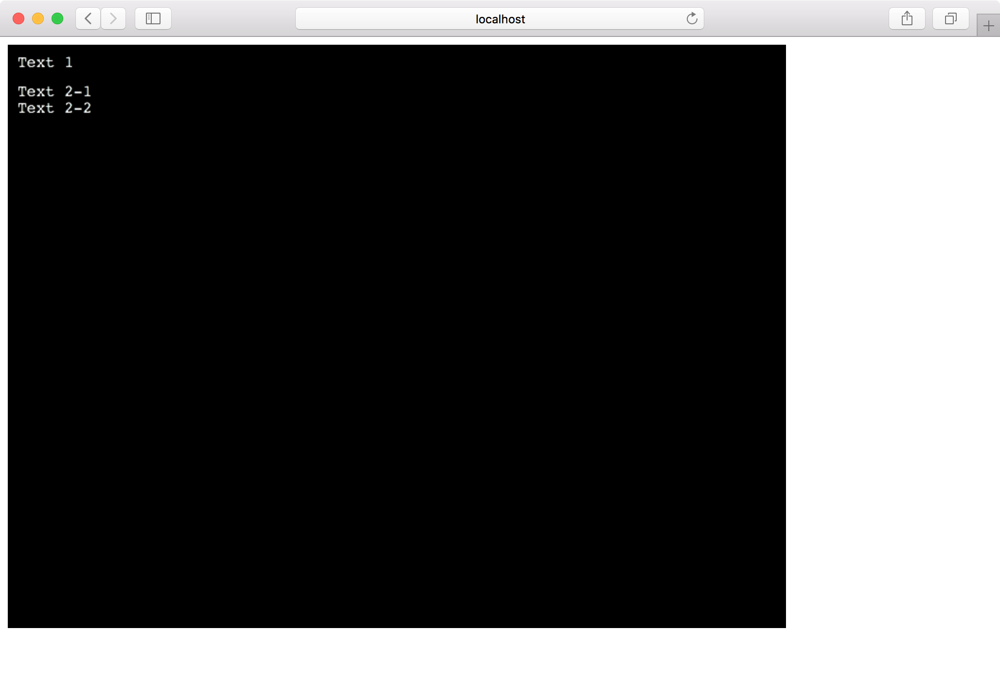
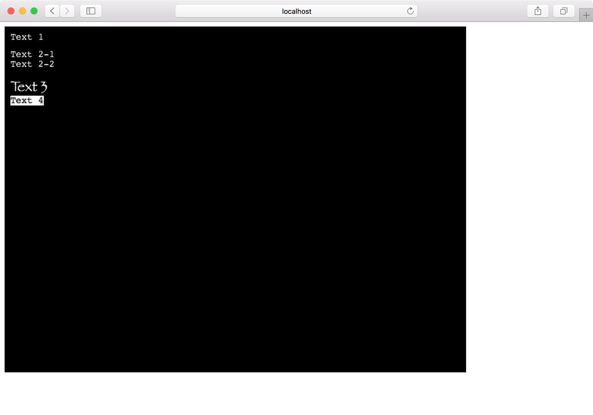

今回からはPhaserのゲームに使うオブジェクトを1つずつ見ていきます。
本日はテキストです。

```
$ git clone git@github.com:tnantoka/hello-phaser-webpack.git phaser-text
$ cd phaser-text
$ yarn install
```

`preload`と`create`を空にして真っ黒な画面が表示されるようにしておきます。

では、テキストを使っていきます。

ドキュメントは<https://photonstorm.github.io/phaser3-docs/Phaser.GameObjects.Text.html>です。

`create`の中で2つテキストを追加してみます。

```
  this.add.text(10, 10, 'Text 1');
  this.add.text(10, 40, ['Text 2-1', 'Text 2-2']);
```

するとこのようになります。

 

第1、2引数はx、y座標です。
第3引数が表示する文字列で配列を渡すこともできます。

第4引数はスタイルで、ドキュメントは<https://photonstorm.github.io/phaser3-docs/Phaser.GameObjects.Text.TextStyle.html>にあります。

こんな感じでCSSのように指定することができます。

```
  this.add.text(10, 90, 'Text 3', { fontSize: '25px', fontFamily: 'fantasy' });
  this.add.text(10, 120, 'Text 4', { backgroundColor: 'white', color: 'black' });
```

このようにスタイルが変わります。

 

他にもいろいろと指定ができますが、基本的なゲームにはこの程度で十分でしょう。

ソースコードはこちらです。

<https://github.com/tnantoka/phaser-text>
