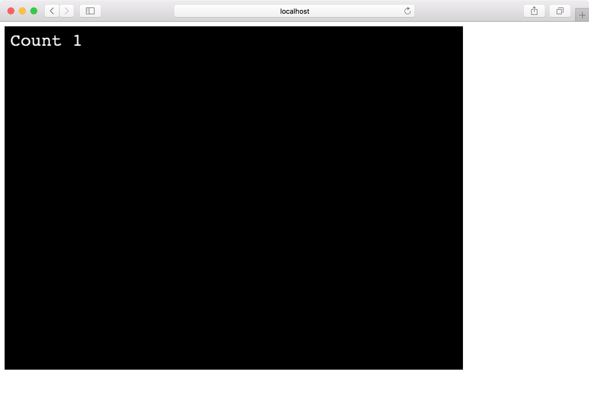

今日はボタンです。

Phaser 3にはボタン用のパーツはありませんが、オブジェクトにイベントを設定することでボタンとして利用できます。

```
$ git clone git@github.com:tnantoka/hello-phaser-webpack.git phaser-button
$ cd phaser-button
$ yarn install
```

`create`の中身を以下のように書き換えます。

```
  let count = 1;
  const text = this.add.text(10, 10, 'Count 1', { fontSize: 30 });
  text.setInteractive();
  text.on('pointerdown', () => {
    count++;
    text.text = `Count ${count}`;
  });
```

これでタップするたびにカウントアップするボタンになっています。

 

 

今回はテキストをボタンとして使いましたが、今後紹介する他のオブジェクトもボタンとして使用可能です。

ソースコードはこちらです。

<https://github.com/tnantoka/phaser-button>
